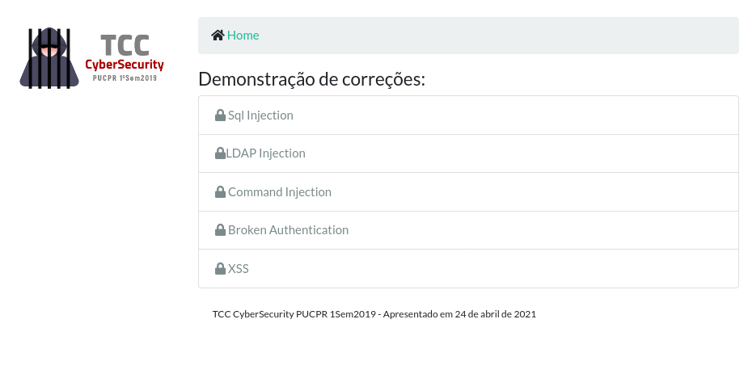

### Aplicação exemplo em Django 

**Atenção:** Possui trechos propositalmente vulneráveis 

#### Instalação:

Baixe o repositório do projeto e certifique-se que você possui o **python3** instalado. Para facilitar os testes e garantir que as bibliotecas utilizadas, prepare um ambiente virtual para execução do aplicativo de testes. 
Caso não possua o módulo venv, ele precisar ser instalado previamente. Por exemplo, num Linux Debian:

```bash
cd /meu_diretorio
git clone https://github.com/zeandrade/tcc_pos_pucpr2019.git
```

```bash
apt-get install python3 python3-venv
```
Então, configure o ambiente virtual:

```bash
cd tcc_pos_pucpr2019
python3 -m venv env_django
```
Na sequência, ative o ambiente virtual e instale as dependências do projeto:

```bash

source env_django/bin/activate
pip install -r requirements.txt
```
**OBs: É necessário um servidor REDIS disponível para a funcionalidade de contenção de ataques de força bruta**

Por fim, rode o aplicativo no modo "desenvolvimento":

```bash

python manage.py runserver
```

